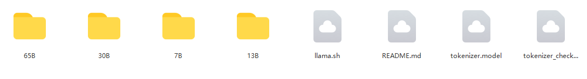

# 探索个人使用chatGPT赚钱攻略

## 这个Repo的意义
Midjourney， NeRF, ChatGPT..., AIGC的发展已经到了一个奇点。作为一名普通人，如何从中发现机会，赚取足够金钱来保障富足的生活，是一个值得研究的问题。
这个Repo想收集，探索，制作与chatGPT赚钱相关的内容，欢迎大家一起讨论。

## 这个Repo的内容（不定时更新）
使用指南， 资料共享，代码分享，应用案例， 资讯交流，其他

## 使用指南
### 1. 基操： 
注册 https://www.awyerwu.com/9273.html

### 2. 使用

## 资料共享
### 1. Facebook 的LLaMA 模型（~240 GB）- 百度网盘下载

网盘链接：链接：https://pan.baidu.com/s/1P_yvrbVrK1W8cwjdhCrMJw 
提取码：y5oj 
 

## 代码共享

## 应用案例

## 资讯交流
### 1. 微信体验交流群
加入体验交流群(请注明github)，与AIGC领域专家和爱好者们一起讨论ChatGPT赚钱攻略
|直接加群                   | 如果群无法使用，加我拉你入群|
|:-------------------------|:--------------------------:|
|  | 
